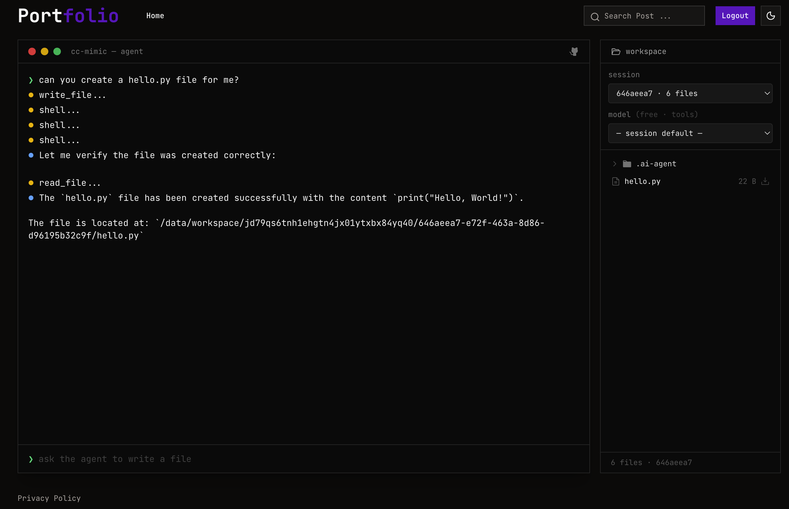

<h1 align="center">⌁ cc-mimic</h1>

<p align="center">A lightweight Claude Code mimic — forge your own AI coding agent.</p>

<p align="center">
  <a href="https://portfolio-delta-five-15.vercel.app/"><b>▶ View Live Demo</b></a>
</p>

<p align="center">
  <a href="https://portfolio-delta-five-15.vercel.app/">
    
  </a>
</p>

---

## ⊹ What it does

A terminal AI coding agent that reads, writes, and runs code in your working
directory — the core loop behind tools like Claude Code, built small enough to
read in one sitting.

| Status     | Feature                                          |
| ---------- | ------------------------------------------------ |
| ✅ Done    | `skill.md` — custom skills                       |
| ✅ Done    | `.ai-agent` project config, initialized per-cwd  |
| ◌ Pending  | Sandboxing                                       |
| ◌ Pending  | LSP (Language Server Protocol)                   |
| ◌ Pending  | `apply_patch`                                    |

---

## ⚡ Quick Start

```bash
python3 -m venv .venv
source .venv/bin/activate
pip3 install -e .
```

Add your API key:

```bash
cp .env.example .env
echo "API_KEY=your_key_here" >> .env
```

Get a key from the [OpenRouter Console](https://openrouter.ai/).

> Environment variables are resolved from the **current working directory**, so
> each project can carry its own `.env`.

---