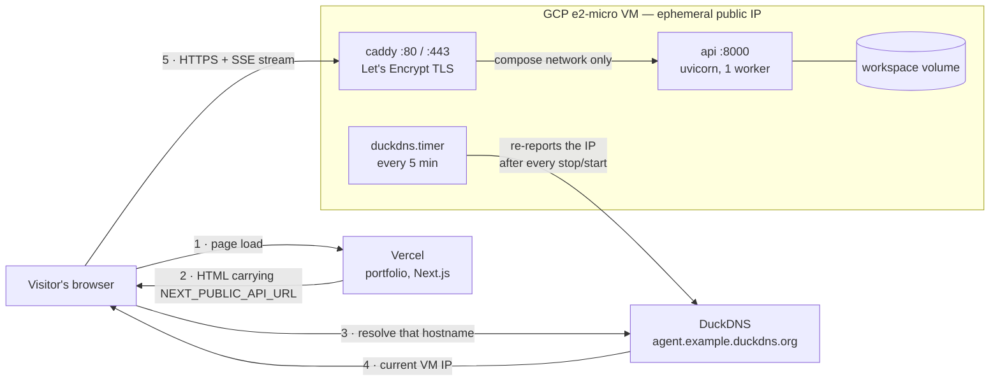
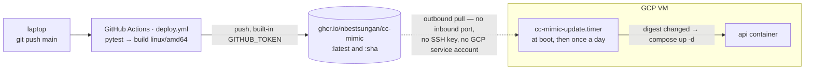

# Deploying cc-mimic to a free VM

Scope: this deploys **cc-mimic only**. The Next.js portfolio deploys to Vercel separately.

**For first-time setup, follow `portfolio/DEPLOY.md`** — it's a single ordered runbook
covering Convex, OAuth, Vercel and this VM (this part is steps 10–14). This page is the
reference for how it works and how to operate it, not the order to do it in.

## Architecture

Two independent paths: how a request reaches the agent, and how new code reaches the VM.
Nothing crosses between them, which is why neither GitHub nor Vercel holds a credential
for the VM.

### Request path, and where DNS fits



Why DNS is load-bearing here: GCP hands the VM an **ephemeral** external IP and takes it
back whenever the instance is STOPPED. The A record would then point at an address that
is no longer yours. `duckdns.timer` re-reports the real IP every five minutes, so a
stop/start heals itself in about thirty seconds. That is also why the timer stayed at
five minutes when the image poll dropped to daily — it is fixing a different problem.

A hostname is not optional. Vercel serves the portfolio over HTTPS, and a browser refuses
to call `http://` from an `https://` page. Caddy needs a real name to get a certificate;
a bare IP cannot have one.

### Deploy path



The VM pulls; CI never pushes to the VM. That is the whole reason no service-account JSON
or SSH key exists anywhere in this repo, and why a changing IP breaks nothing about
deploys.

## What you need to do

```bash
# update command 
gcloud compute ssh cc-mimic --zone=us-central1-a --command 'sudo bash ~/deploy/update.sh'
```