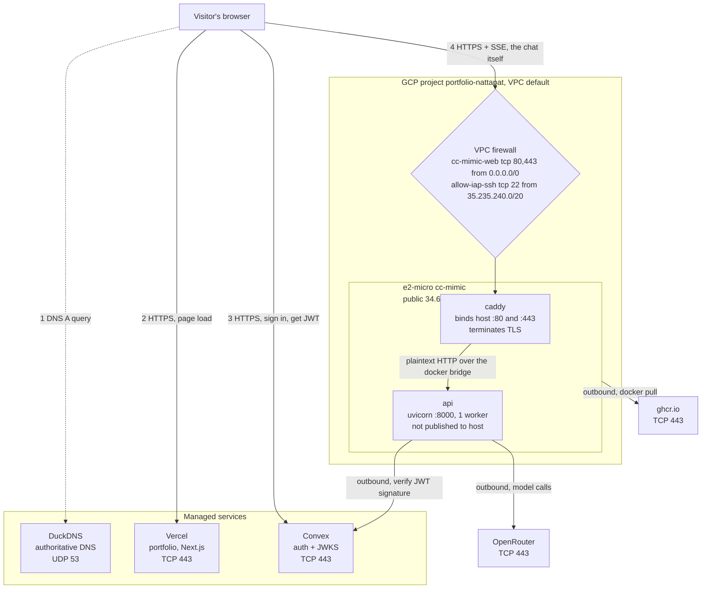
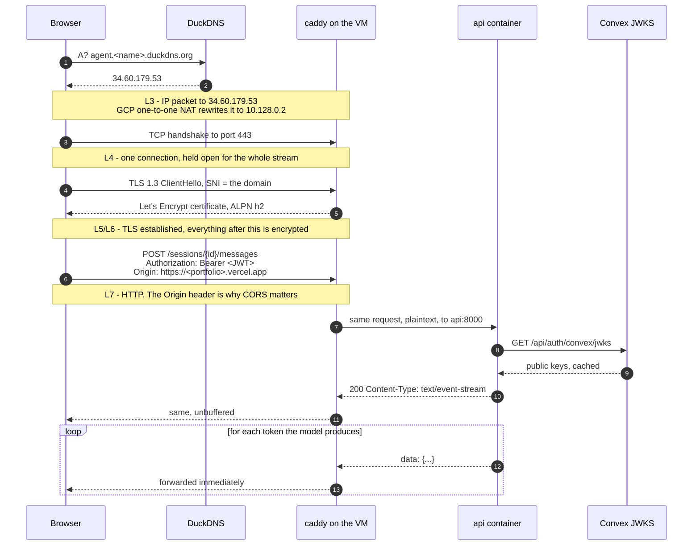

# Network architecture — Vercel front end to GCP back end

The front end and the back end are on different providers and never talk to each other.
Everything is stitched together in the visitor's browser: Vercel serves a page, that page
holds a URL pointing at the VM, and the browser opens a second, independent connection.

That single fact explains most of the design — the separate domain, the certificate on the
VM, and why CORS exists at all.

## Topology

Note the direction of every arrow touching the VM. Exactly one points inward — the
browser's, on 443. Everything else the VM initiates itself, which is why it survives
having no static IP and no inbound access beyond the web ports.

## One chat message, layer by layer

The interesting part is step 3 onward. The browser opens **one** TCP connection and holds
it for the entire reply — that is what SSE is. It is not polling, and there is no second
request per token.

| Layer | What is happening | Where it can break |
|---|---|---|
| L7 · HTTP | Path, `Authorization: Bearer`, `Origin`, `text/event-stream` | Wrong `ALLOWED_ORIGINS` → browser blocks the response after it arrived |
| L6/L5 · TLS | TLS 1.3, SNI selects the cert, ALPN negotiates h2 | Cert expired or DNS stale → `ERR_CERT_*`, connection refused |
| L4 · TCP | One long-lived connection on 443 | Idle timeout or proxy buffering → stream stalls or arrives in one lump |
| L3 · IP | Public 34.60.179.53, NAT'd to NIC address 10.128.0.2 | VM stopped → new public IP, DNS points nowhere |
| L2/L1 | Google's network | Not your problem |

## Ports

| Port | Listening on | Process | Who can reach it |
|---|---|---|---|
| 443 | VM host, all interfaces | caddy container | Anyone — `cc-mimic-web`, target tag `cc-mimic` |
| 80 | VM host, all interfaces | caddy container | Anyone. Needed for the ACME HTTP-01 challenge and the redirect to 443 |
| 8000 | docker bridge only | uvicorn | Only the caddy container. `expose:` in compose, never `ports:` — so it has no host binding at all |
| 22 | VM host | sshd | IAP range `35.235.240.0/20`, plus **`0.0.0.0/0` while `default-allow-ssh` still exists** |

Port 8000 is the one worth understanding. `expose:` is documentation plus a docker-network
address; it creates no host binding and no iptables DNAT rule. Even with every firewall
rule deleted, nothing outside the VM could reach uvicorn — the packets have nowhere to
land.

## Two firewalls, in order

A packet to 443 passes both before anything sees it:

1. **GCP VPC firewall** — outside the VM, enforced by Google's network. `cc-mimic-web`
   allows 80 and 443 to instances tagged `cc-mimic`.
2. **The VM's own iptables** — `vm-setup.sh` inserts ACCEPT rules for 80 and 443. This is
   there because Oracle images ship a REJECT rule; on GCP it is usually a no-op.

Docker adds its own DNAT rules for published ports, which is why `ports:` on the api
service would have punched through both layers without either firewall changing.

## Why the back end needs its own certificate

The page is served from `https://…vercel.app`. A browser refuses to let an HTTPS page open
a plain `http://` connection — mixed content — so the VM must speak HTTPS too. A
certificate can only be issued for a **name**, never a bare IP, which is the whole reason
DuckDNS is in the diagram. Caddy requests one on first boot and renews it automatically,
keeping it in the `caddy_data` volume.

## CORS is a browser rule, not a firewall

`ALLOWED_ORIGINS` in `/etc/cc-mimic/env` feeds FastAPI's `CORSMiddleware`. When it is
wrong, the request still reaches the VM, the app still runs it, and the response still
comes back — the browser then discards it and logs a CORS error. Nothing is blocked at the
network level.

That is worth internalising: CORS protects other people's browsers from your API, not your
API from other people. `curl` ignores it entirely. Authentication is the JWT, checked in
`app.py` against Convex's JWKS.

## Why one worker

`Dockerfile` ends with `--workers 1`, and it is load-bearing. Sessions live in the API
process's memory, so a second worker would answer half the requests with "no such session".
It also means a restart drops every open SSE stream — which is what a deploy does.

## Outbound

Nothing needs a firewall rule; GCP allows egress by default.

| To | Why | Notes |
|---|---|---|
| Convex `:443` | Fetch JWKS to verify JWTs | Cached, so not per-request |
| OpenRouter `:443` | Model calls | The bulk of latency |
| ghcr.io `:443` | `docker pull` on deploy | Ingress is free; egress is what GCP bills |
| DuckDNS `:443` | IP updates — **not installed on this VM** | See the README |
