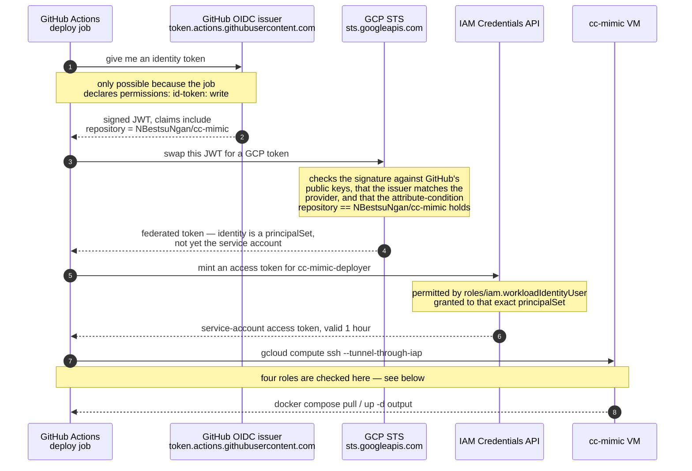

# How GitHub Actions gets into the VM without a key

There is no service-account JSON anywhere — not in the repo, not in GitHub secrets, not on
disk. Instead every run mints a fresh token that expires in an hour. This is the exchange.

## The flow



Steps 1–3 are the part worth understanding. GitHub will hand an identity token to any
workflow that asks, but the token says *which repository asked*. GCP is configured to
accept exactly one answer. That claim is the entire security boundary — there is no shared
secret on either side, just a signature GCP can verify and a name it can compare.

## What makes each step happen

Numbers match the diagram. Three of the nine steps are not caused by anything we wrote —
they are GitHub or GCP responding — and those are marked as such.

**1 · The job asks GitHub for an identity token**

`.github/workflows/deploy.yml:70-72`. Without this the token endpoint is not even exposed
to the job, and `auth` fails with `Unable to get ACTIONS_ID_TOKEN_REQUEST_URL`.

```yaml
    permissions:
      contents: read
      id-token: write        # required to mint the OIDC token WIF verifies
```

**2 · GitHub returns a signed JWT** — no code of ours. GitHub builds the claims from the
run itself; `repository` is `NBestsuNgan/cc-mimic` because that is where the job ran. The
claims cannot be forged by the workflow.

**3 · The token is sent to GCP for exchange**

`.github/workflows/deploy.yml:76-79`. The action does the HTTP call; `workload_identity_provider`
tells it which provider to present the JWT to.

```yaml
      - uses: google-github-actions/auth@v3
        with:
          workload_identity_provider: ${{ vars.GCP_WIF_PROVIDER }}
          service_account: ${{ vars.GCP_SERVICE_ACCOUNT }}
```

`vars.GCP_WIF_PROVIDER` is the repository variable
`projects/1033067715457/locations/global/workloadIdentityPools/github/providers/github`.

**4 · GCP validates the JWT**

Not in the repo — it is the provider created once with gcloud. `--issuer-uri` is how GCP
knows which public keys verify the signature; `--attribute-condition` is the line that
restricts this to one repository.

```bash
gcloud iam workload-identity-pools providers create-oidc github \
  --location=global --workload-identity-pool=github \
  --issuer-uri="https://token.actions.githubusercontent.com" \
  --attribute-mapping="google.subject=assertion.sub,attribute.repository=assertion.repository" \
  --attribute-condition="assertion.repository=='NBestsuNgan/cc-mimic'"
```

Read it back with:

```bash
gcloud iam workload-identity-pools providers describe github \
  --location=global --workload-identity-pool=github --project=portfolio-nattapat
```

**5 · GCP returns a federated token** — no code of ours. The identity at this point is a
`principalSet`, not the service account yet.

**6 · The action asks to become the service account**

The `service_account:` line in step 3 is what triggers this. Omit it and you stop at step
5 with a federated token, which none of the four roles below are granted to.

**7 · IAM allows the impersonation**

Not in the repo — a one-time binding. The `principalSet` in `--member` must match the
repository in the attribute condition exactly, or this is the step that fails.

```bash
gcloud iam service-accounts add-iam-policy-binding \
  cc-mimic-deployer@portfolio-nattapat.iam.gserviceaccount.com \
  --role=roles/iam.workloadIdentityUser \
  --member="principalSet://iam.googleapis.com/projects/1033067715457/locations/global/workloadIdentityPools/github/attribute.repository/NBestsuNgan/cc-mimic"
```

**8 · gcloud uses the token to reach the VM**

`.github/workflows/deploy.yml:90-100`. No credential appears here — `auth` wrote one to
disk and exported `CLOUDSDK_AUTH_CREDENTIAL_FILE_OVERRIDE`, so gcloud picks it up.

```yaml
      - name: Pull the new image on the VM
        run: |
          set -o pipefail
          gcloud compute ssh "${{ vars.GCP_VM_NAME }}" \
            --project="${{ vars.GCP_PROJECT }}" \
            --zone="${{ vars.GCP_ZONE }}" \
            --tunnel-through-iap --quiet \
            --command='sudo bash -c "cd /opt/cc-mimic && ..."' \
            | tee -a "$GITHUB_STEP_SUMMARY"
```

`--tunnel-through-iap` is what makes this work with port 22 closed. The four roles checked
during this single step are in the table below.

**9 · The VM returns output** — no code of ours, just the container's stdout piped into the
run summary.

## Which role gates which step

Every one of these produced a real failure while setting this up, and none of the error
messages mentioned the role by name.

| Step | Role | Granted on | Symptom when missing |
|---|---|---|---|
| 4 · exchange the JWT | `roles/iam.workloadIdentityUser` | the service account | `unable to impersonate` |
| 8 · look the VM up | `roles/compute.viewer` | the project | instance `not found` |
| 8 · open the tunnel | `roles/iap.tunnelResourceAccessor` | the project | connection hangs, then times out |
| 8 · log in and `sudo` | `roles/compute.osAdminLogin` | the instance | `Permission denied (publickey)` |
| 8 · attach to the VM | `roles/iam.serviceAccountUser` | the VM's *own* service account | `does not have iam.serviceAccounts.actAs permission` — says nothing about SSH |

The last one is the trap. `gcloud compute ssh` refuses to connect to any VM that has a
service account attached unless the caller can act as it, and yours has the default
Compute Engine account attached.

## Why this beats a JSON key

| | JSON key | This |
|---|---|---|
| Lives where | GitHub secrets, forever | nowhere — minted per run |
| Valid for | until you revoke it | 1 hour |
| If leaked | full access until noticed | useless, and only your repo can mint one |
| Rotation | manual, easy to forget | automatic |

## What this does not protect against

The boundary is "a workflow running in this repository." Anything that can run a workflow
here can get a token. Today that means `push` to `main` and manual dispatch — a pull
request from a fork cannot trigger it.

Adding a `pull_request` trigger to `deploy.yml` would break that, because a stranger's PR
would then run with this identity. Put PR checks in a separate workflow that does not
declare `id-token: write`.
